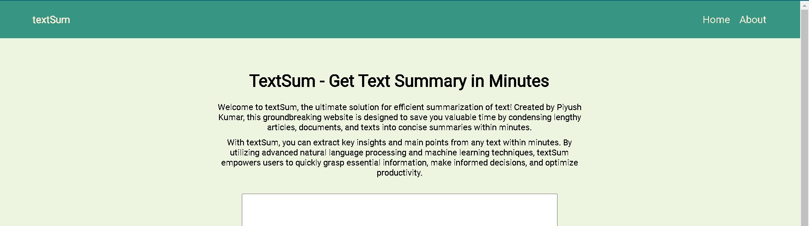
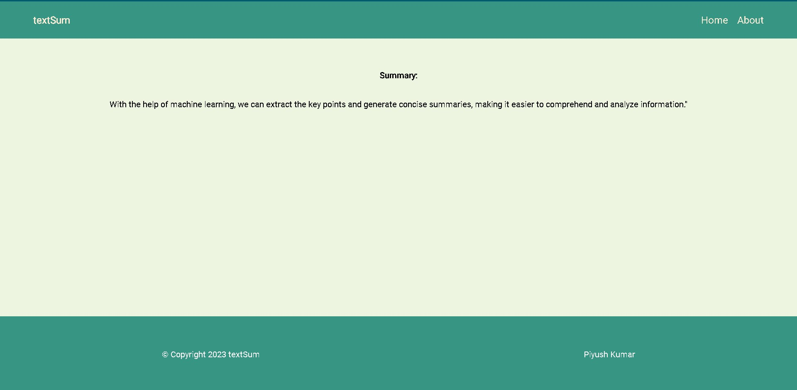

# Text Summarization Project

Welcome to my Text Summarization project! This project utilizes machine learning techniques to automatically generate concise summaries of given text inputs. In this README, I will provide an overview of the project and discuss the importance of machine learning in our daily lives.

## Table of Contents

- [Introduction](#introduction)
- [Features](#features)
- [Installation](#installation)
- [Usage](#usage)
- [Examples](#examples)
- [Contribution Guidelines](#Contribution-Guidelines)
- [License](#license)

## Introduction

In today's information-driven world, we are constantly bombarded with vast amounts of textual content from various sources. Digesting and understanding all this information can be a time-consuming task. Text summarization, a subfield of natural language processing (NLP), addresses this challenge by automatically extracting the most important information from a given text and presenting it in a concise manner.

This project aims to leverage the power of machine learning algorithms and techniques to build an effective text summarization system. By utilizing various NLP approaches, we can summarize large documents, articles, or even social media posts into key points, saving valuable time and effort for users.

## Features

- **Automatic Summarization**: The project employs machine learning models to automatically generate summaries of input text.
- **Efficiency**: The implemented algorithms ensure efficient processing of large volumes of text, enabling quick summarization even for lengthy documents.

## Installation

To install and set up the Text Summarization project, follow these steps:

1. Clone the repository: `git clone https://github.com/your-username/text-summarization.git`
2. Navigate to the project directory: `cd text-summarization`
3. Install the required dependencies: `pip install -r requirements.txt`
4. Download any additional resources or models as instructed in the project documentation.

## Usage

1. Import the necessary modules and classes into your Python script.
2. Load the pre-trained summarization model or train your own model using the provided training data.
3. Preprocess your input text by tokenizing and cleaning it, if required.
4. Pass the preprocessed text to the summarization model and retrieve the generated summary.
5. Utilize the summary for further analysis, decision-making, or any other desired purposes.

For detailed usage instructions and code examples, please refer to the project's documentation.

## Examples

Here are a few examples to demonstrate the effectiveness of the Text Summarization project:

**Example 1:**

Input Text:

`"The advancements in machine learning have revolutionized the way we interact with technology. From virtual assistants to recommendation systems, machine learning algorithms have become an integral part of our daily lives. In the field of natural language processing, text summarization plays a crucial role in saving time and effort when dealing with large volumes of textual content. With the help of machine learning, we can extract the key points and generate concise summaries, making it easier to comprehend and analyze information."`

Generated Summary:

`With the help of machine learning, we can extract the key points and generate concise summaries, making it easier to comprehend and analyze information."`

## Contribution Guidelines

We welcome and appreciate contributions to our project. To ensure a smooth collaboration, please follow these guidelines:

### Reporting Issues

If you encounter any issues or bugs, please submit a detailed bug report using the GitHub issue tracker. Include steps to reproduce the problem, expected behavior, and any relevant error messages.

### Feature Requests

If you have a suggestion for a new feature or improvement, please submit a feature request using the GitHub issue tracker. Provide a clear description of the proposed functionality and any relevant use cases.

### Pull Requests

We accept pull requests for bug fixes and new features. Before submitting a pull request, please follow these steps:

1. Fork the repository and create your branch from `master`.
2. Make your changes, ensuring that your code adheres to our coding standards.
3. If adding new functionality, include appropriate tests and ensure that existing tests pass.
4. Submit a pull request, providing a clear description of your changes and referencing any related issues.

### Code Style

Please follow our code style guidelines when contributing to the project. This includes indentation, naming conventions, and formatting. If possible, run the linter and ensure that your code meets the defined standards.

## License

This project is licensed under the MIT License. By contributing to this project, you agree to the terms and conditions outlined in the license file.

## Live link 

[click here to use the app](https://text-summarization-eid3.onrender.com)

Please just use it for testing purposes as it is hosted on a free tier plan. Star if you like it!!

